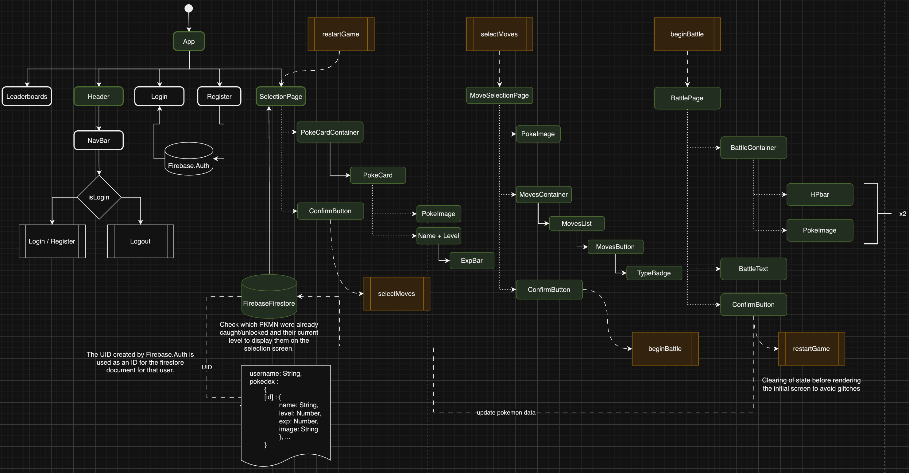
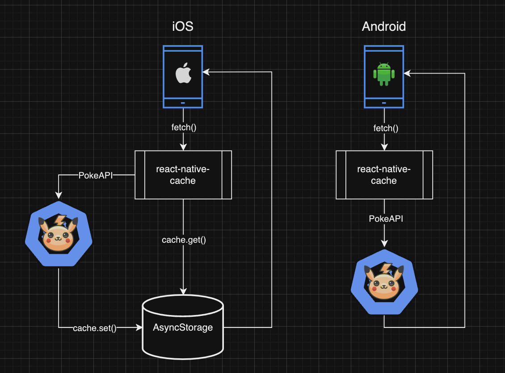

# INFO-6129 - Cross Platform Mobile Development
---
## Course Project: PokeBattle RPG
### Livio Reinoso - ID 1165606
---
# Planning document
---

## Project Idea

The project idea to implement what I have learned throughout the course is an idle [Role-Playing Game](https://en.wikipedia.org/wiki/Role-playing_video_game) (RPG) based on the Pokemon main series games (MSG). This will be implemented on three different screens to be described in the next few sections.

---
## Selection screen

In this game, the user (also referred as ‘player’ throughout the document) will start with a small selection of predefined pokemon from where to choose from and will engage in battle against computer-controlled opponents. The initial selection of pokemon will be Ivysaur, Wartortle, and Charmeleon (all three of them are the second stage evolution of the [starter pokemon](https://bulbapedia.bulbagarden.net/wiki/First_partner_Pok%C3%A9mon) of Gen 1 Bulbasaur, Squirtle and Charmander), along with Pikachu, all four of them at level 25.

This list of available pokemon will increase whenever the player defeats a new pokemon in battle, adding the pokemon to the list, at the level that such pokemon was defeated (e.g. if a Raichu level 14 is defeated by the player, the player will have a Raichu level 14 available in the selection screen to choose from now onwards).

The data to populate the list is being taken from Firestore, by using a UID hardcoded for this project. One of the proposed next steps after the completion of this project is to implement a register and login page, so each user can have their own collection of pokemon and individual progress.

After the user selects a pokemon the information about its stats and moves is requested from the cache or the PokeAPI, depending on the availability of information in the cache. Once the information is correctly loaded, a confirmation button is enabled, allowing the user to move to the next screen by conditionally rendering it upon tapping this button.

---
### Pokemon level and experience points

The level of these pokemon will increase too while using them in battle and defeating other pokemon. To increase their level, a pokemon should earn a certain amount of experience, according to the table available in [this table](https://bulbapedia.bulbagarden.net/wiki/Experience#Experience_at_each_level). The equation chosen to calculate the experience curve of all pokemon in this app is the [Medium Slow](https://bulbapedia.bulbagarden.net/wiki/Experience#Medium_Slow). 

The experience earned on each battle depends on the rival pokemon and its level and will only be earned if the player wins the battle. The formula used to calculate the [amount of earned experience](https://bulbapedia.bulbagarden.net/wiki/Experience#Experience_gain_in_battle) is the one from Generation VII onwards, setting all the latest variables to 1 by default for the purposes of this application.

---
## Moves Selection screen

First the player needs to pick one to four moves (also mentioned as ‘attacks’) from the list of moves that the pokemon has available for its current level. This is also based on the MSG where each pokemon should have at least one move, and a maximum of four to choose from.

The moves are classified into two main categories: 💥physical moves, and 🌀special moves. Depending on the category that the move belongs to, it will use the attack (Atk) or special attack (SpA) stat of the pokemon to calculate the damage that will do, as well as the defense (Def) or special defense (SDf) stat of the pokemon that will receive the damage to calculate how much of that damage will be prevented (more about this in the [Battle screen section](#battle-screen)).

Each move will have a base power and an accuracy stat. The first is the value that will be used along with the Atk/SpA stat to calculate the intended damage, while the second is the probability of this attack to hit or miss the opponent.

Last but not least, each move will have a typing, which will apply different multipliers to the intended damage and the effective received damage (more about this in the [Battle screen section](#battle-screen)).

---
## Battle screen

The battles will play out automatically (hence why this is an [idle game](https://mobilefreetoplay.com/idle-games-everything-you-need-to-know/)) and the player will be able to watch them in real time, with visual indicators of the remaining health of each pokemon (also referred to as Hit Points, or HP) surrounding them, and [messages](#display-messages) at the bottom of the screen displaying what is going on during the battle.
In between the health bars there’s a display where the player will be able to see which pokemon are battling, being its own pokemon on the bottom left corner, facing the opponent pokemon that is on the upper right corner.

Taking turns based on the pokemon base speed (Spd) stat, each pokemon will select a random move (from the moves selected in the previous screen for the player’s pokemon, and from a random selection of up to four moves picked automatically before the battle for the opponent pokemon), and the app will calculate the final damage caused by these moves based on its power, criticality, type effectiveness and a randomness factor.

### Display messages

At the bottom of the screen a message will display what is going on during the battle. These messages are being displayed for a certain period of time and then hidden for a few milliseconds while changing the message content to produce a smoother effect to the user’s view. This is achieved by creating an asynchronous function that wraps-up a promise which resolves after a setTimeout block is triggered.

### Damage calculation

To calculate the damage to be done by a pokemon attack to the defending pokemon the app uses the MSG from [generation V onward damage formula](https://bulbapedia.bulbagarden.net/wiki/Damage#Generation_V_onward). This formula is based on many factors, but a simplified version of it was implemented for this app. The implemented version will take into account:

- Power of the selected move (after [STAB calculation](#type-effectiveness))
- Level of the attacking pokemon
- The Atk or SpA stat of the attacking pokemon
- The Def or SpD stat of the defending pokemon
- Type effectiveness of the move against the defending pokemon
- Critical hit multiplier, if applicable
- Random factor

### Critical hits
There’s a random chance for a move to be a critical hit. This is calculated as 1 in 24, based on the [Generation VII onward base chance](https://bulbapedia.bulbagarden.net/wiki/Critical_hit#Probability_2) to land a critical hit. If an attack is deemed to be a critical hit, its power is increased by x1.5.

### Type effectiveness
Each pokemon can have one or two elemental types, and each attack has an elemental type as well. If the type of the attack matches a type of the attacking pokemon, the power will be multiplied by x1.5 due to Same-Type Attack Boost (STAB). On the defensive side, the damage can be reduced, increased, left the same, or entirely annulled due to the type/s of the defending pokemon, according to the [type effectiveness chart](https://bulbapedia.bulbagarden.net/wiki/Type#Type_chart). 

#### Type effectiveness examples
For instance, if a pokemon uses a fire-type attack on a pokemon that has a dual steel/ice typing, this attack will do x4 damage (x2 from the steel weakness to fire and x2 from the ice weakness to fire); if the attacking pokemon is also a fire-type pokemon, the x1.5 STAB will add on top of that resulting in a x6 damaging move.

If a grass-type pokemon uses a grass-type move against a dual fire/water type pokemon, the move power will be increased x1.5 due to STAB, x2 due to water being weak against grass and reduced in half due to fire being resistant to grass, resulting in a x1.5 final multiplier.

If an electric-type move is used by an electric-type pokemon against a dual water/ground pokemon, it wouldn’t matter the modifiers applied due to STAB and water weaknesses because the x0 multiplier of ground being immune to electricity will take over.

### Random factor

To include more uncertainty to the damage to be done from one pokemon to the other every time that a move is selected, a random factor is added into the damage calculation formula, that will modify the final damage in a range going from 85% to 100%.

---

## Battle outcome

After the HP of one of the pokemon reaches zero, the battle ends. Depending on the outcome of the battle, (i.e. if the player’s pokemon defeats the opponent pokemon) the user will catch the opponent pokemon and the winning pokemon will earn experience points (EXP) that will allow them to level up and learn new moves. The player will then be taken back into the updated selection screen.

---

## APIs to use
- [PokeAPI](https://pokeapi.co/docs/v2): to get the pokemon and moves data.
- [Firebase Firestore SDK](https://firebase.google.com/docs/firestore/client/libraries): to store the state of the user’s pokemon collection.

---

## Libraries to use
- [Firebase](https://docs.expo.dev/guides/using-firebase/): to store the state of the user’s pokemon collection
- [React-native-async-storage](https://react-native-async-storage.github.io/async-storage/): to locally store the PokeAPI data to access it faster than from the internet (iOS, please see [Annex B](#annex-b---ios-and-android-cache-strategies)).
- [React-native-cache](https://www.npmjs.com/package/react-native-cache): builded on top of AsyncStorage to help with the data storage and retrieval (iOS, please see [Annex B](#annex-b---ios-and-android-cache-strategies)).

---

## Potential risks
- The implementation of what could be called the business logic for this project can take too long, especially factoring in the many different variables to be taken into consideration to make an actual pokemon battle work.
- Caching can increase the app’s performance, but it may be harder to implement on a React Native app in comparison to a browser-based app.
- The components integration can make the application hard to implement at first, taking into account the interactions between them and the styling of them.
- The functionality of the whole project depends entirely on the status of the PokeAPI being up, so an API shortage can compromise the app.
- A slow internet connection can compromise the user experience until the assets are correctly cached, in particular for some pokemon that can learn an unusual number of moves, such as Mew.

---

## Future improvements
- Implementation of a register and login screen to allow for individual pokemon collections for each user.
- Implementation of a leaderboards screen to keep track of high scores and add a competitive element to the game.
- Create a Navigation Bar component to display the username and allow the user to sign in/sign up/sign out easily.
- Add the chance of a pokemon to be a [shiny version](https://bulbapedia.bulbagarden.net/wiki/Shiny_Pok%C3%A9mon) of itself to include a collector/completionist edge to the game.
- Include sound effects for every attack.
- Include visual effects for every attack.
- Add cache support for the Android version in a storage space that allows for big amounts of data (currently up to 6 MB).
- Lock the screen in portrait mode.
- Animating the battle background image.
- Add offline support.

---

## Annex A - [Project diagram](https://drive.google.com/file/d/1t6F9h_XUMR8oMUFlOlaPRfSz3zyOXZDT/view?usp=sharing)
The following diagram represents the project structure. 
The green colored elements represent what was created for this project, while the elements left without a color are the ones that are intended to be implemented in the future for this app. 
The orange components are the starting and end points of each one of the app screens.

---

## Annex B - [iOS and Android cache strategies](https://drive.google.com/file/d/1t6F9h_XUMR8oMUFlOlaPRfSz3zyOXZDT/view?usp=sharing)
The app stores the data retrieved from the API on the AsyncStorage with the use of the react-native-cache library. 
However, this is only applicable for the iOS version of the app, which provides “unlimited” storage space in the AsyncStorage. 
This is not the case for Android where there’s only 6Mb of data storage available, which is not enough to hold all the pokemon and moves data (~200Mb).

---

## Annex C - Assets references
- [Logo image](https://www.flaticon.com/free-icon/mystic_189011)

- [Background Image](https://fiverr-res.cloudinary.com/images/q_auto,f_auto/gigs/204364595/original/86db6005cd51b4f60e71cca277f603a82cf5646a/draw-a-pixel-pokemon-battle-background.png)

- [Ditto](https://raw.githubusercontent.com/PokeAPI/sprites/master/sprites/pokemon/other/showdown/back/132.gif)

- [Pokemon ghost](https://www.lifewire.com/thmb/htqRVxl-KVsa4jLcCuZN3rUCZaU=/1500x0/filters:no_upscale():max_bytes(150000):strip_icc()/PokeGhost-5bc39ae74cedfd0051154962.png)

:max_bytes(150000):strip_icc()/PokeGhost-5bc39ae74cedfd0051154962.png)
